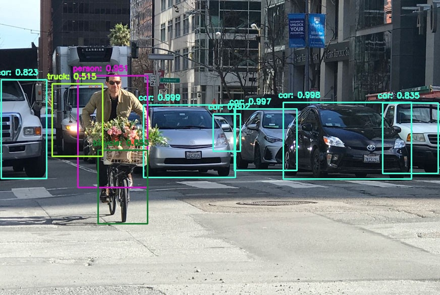

OBJECT DETECTION
=====================

This simple project uses the YOLO algorithm and opencv to detect objects.



Download the pre-trained yolo weight file for COCO dataset [https://pjreddie.com/media/files/yolov3.weights](https://pjreddie.com/media/files/yolov3.weights).

Make sure you have python installed and further installed these dependencies:
    - opencv-python
    - numpy
    - argparse

To test this out:
    1. Copy your image in the images directory
    2. Execute the scripts with these arguments:
        ``` 
            python detection.py -i images/{your-image} -c yolov3.cfg -cl classes.txt -w yolov3.weights
        ```
    3. The detected image will show up in a floating window.
    4. The detected image will be saved in the detected directory with the same name.
